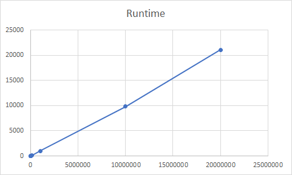

# Merge intersecting intervals
## Description: 
implementation of an interval merging algorithm using python and numpy

## Dependencies:
* python 3.9
* numpy package
* prettytable package (only for timecapture.py)

## Usage:
### install required packages
` python3 -m pip install -r requirements.txt `

### run unit tests
`python3 ./source/mergertest.py`

### run time test (may take some minutes)
`python3 ./source/timecapture.py`

### run the interval merger 
#### without parameter 
`python3 ./source/main.py`

uses the `input_data.json` file in the projects main directory

#### with integer parameter
`python3 ./source/main.py <integer>`

generates the integer amount a random intervals as input

##### example: `python3 ./source/main.py 123`

#### with array parameter

`python3 ./source/main.py <array of intervals>`

uses the commandline parameter as imput data

##### example: `python3 ./source/main.py [[1,3],[1,4],[5,6]]`


## algorithm runtime and memory

### time capture
(only merge, without creating random data)
```
+----------------+---------------+
| interval_count | duration (ms) |
+----------------+---------------+
|       5        |    0.08297    |
|       10       |    0.04005    |
|      100       |    0.11301    |
|      1000      |    0.71025    |
|     10000      |    7.29513    |
|     100000     |    88.63187   |
|    1000000     |   1020.89405  |
|    10000000    |   9836.08985  |
|    20000000    |   21083.0462  |
+----------------+---------------+
```


### runtime estimation
* mergesort: O(n*log(n))
* numpy array operations that manipulate data are O(n)
* numpy operations that manipulate the structure of the array are O(1)

### memory usage
* numpy.ndarray that only contains int values is (n * 64) bit plus a small size independent overhead
#### Example: (1000000 Entries * 64bit) / 8 is about 8MByte

### robustness
pythons numpy library is optimized for handling numeric array of large size.
maximum array size is 2708000000 entries, handling of huge inputs should only be limited by avalable RAM 
and by time needed

## working time
* implementing the algorithm, input and output: 4h
* unit tests and time capture: 2h
* dokumentation and readme: 1h
